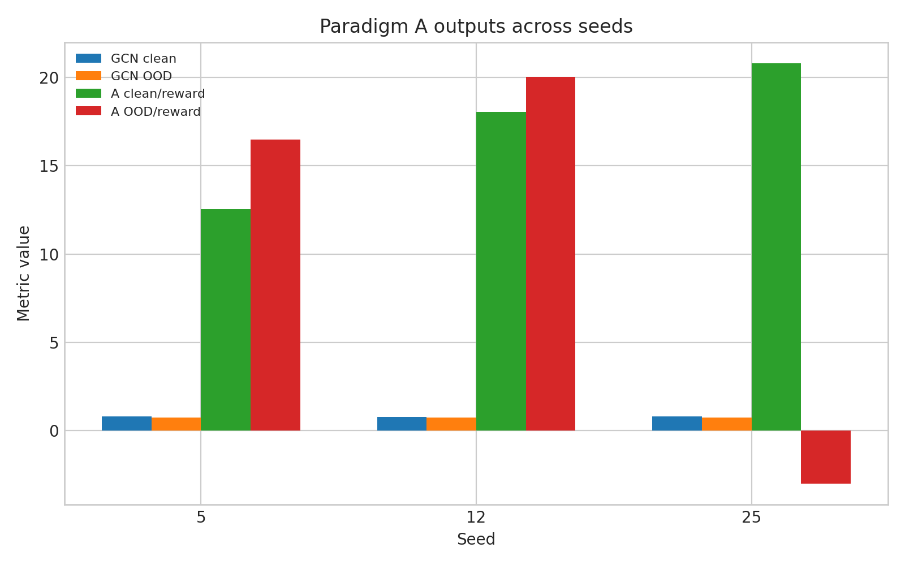
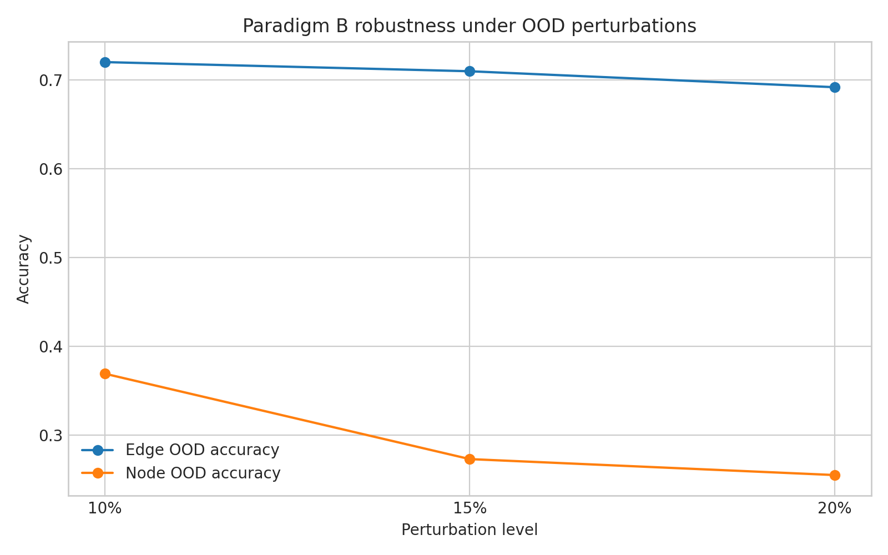
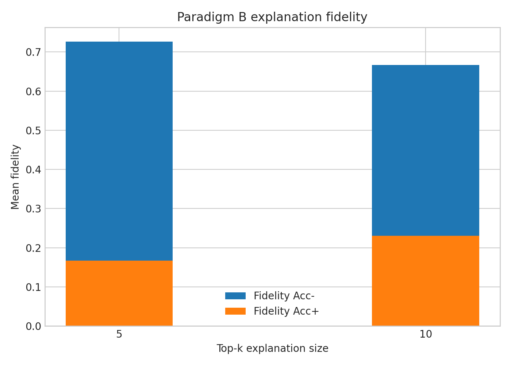

# Final Project Conclusion: Paradigm A vs Paradigm B

## Project outcome
This project compared two hybrid DRL-GNN pipelines on the Cora dataset using the attached result files. Paradigm A was reported through three CSV evaluation files, while Paradigm B was reported through summary, fidelity, and OOD JSON outputs.

The results indicate that **Paradigm B** is the more reliable and publication-ready pipeline for this project. Its test accuracy is stable around 0.746 across seeds, its 15% perturbation OOD accuracy remains around 0.709, and its explanation fidelity and per-node runtime are consistent enough to support a strong final conclusion.

## Included figures

## Paradigm A results
Paradigm A was evaluated on seeds 5, 12, and 25. The attached CSV files show a conventional GCN baseline and a PPO-based ParadigmA agent side by side.

### Seed-wise results from CSV files
| Seed | Model | Clean acc/reward | OOD acc/reward | OOD drop | Latency (ms) |
|---|---|---:|---:|---:|---:|
| 5 | GCN_baseline | 0.7980 | 0.7410 | 0.0570 | 26.0 |
| 5 | ParadigmA_PPO | 12.5508 | 16.4847 | -3.9339 | 15994.2 |
| 12 | GCN_baseline | 0.7740 | 0.7500 | 0.0240 | 231.7 |
| 12 | ParadigmA_PPO | 18.0577 | 20.0213 | -1.9636 | 48103.9 |
| 25 | GCN_baseline | 0.8000 | 0.7420 | 0.0580 | 37.5 |
| 25 | ParadigmA_PPO | 20.7979 | -2.9896 | 23.7875 | 22443.0 |

### Aggregated view for Paradigm A
| System | Mean clean acc/reward | Mean OOD acc/reward | Mean OOD drop | Mean latency (ms) |
|---|---:|---:|---:|---:|
| GCN baseline | 0.7907 | 0.7443 | 0.0463 | 98.4 |
| ParadigmA_PPO | 17.1355 | 11.1721 | 5.9633 | 28847.0 |

The baseline behaves like a standard node-classification model, with clean accuracy around 0.791 and OOD accuracy around 0.744. In contrast, the PPO agent outputs much larger values on the `clean_acc_or_rew` and `ood_acc_or_rew` columns, which suggests these fields are reward-like values rather than directly comparable classification accuracies.

A second important observation is latency. The GCN baseline stays in the tens to low hundreds of milliseconds, while Paradigm A PPO ranges from about 16,000 ms to 48,000 ms, making it far more expensive computationally.

## Paradigm B results
Paradigm B was reported as a DRL→GNN pipeline with GNNExplainer on Cora.

### Core summary
| Metric | Value |
|---|---:|
| Mean test accuracy | 0.7463 |
| Test accuracy std | 0.0160 |
| Mean fidelity acc+ | 0.7333 |
| Fidelity acc+ std | 0.0850 |
| t-statistic vs chance | 21.8204 |
| p-value vs chance | 0.0021 |
| Mean time per node (s) | 4.35 |

### Seed-wise Paradigm B performance
| Seed | Test accuracy | Fidelity acc- top-5 | Fidelity acc- top-10 | Time per node (s) |
|---|---:|---:|---:|---:|
| 42 | 0.768 | 0.700 | 0.700 | 4.46 |
| 43 | 0.741 | 0.650 | 0.550 | 4.30 |
| 44 | 0.730 | 0.850 | 0.800 | 4.28 |

### OOD robustness for Paradigm B
| Perturbation | Mean OOD acc | Mean acc drop |
|---|---:|---:|
| 10% | 0.731 | 0.019 |
| 15% | 0.709 | 0.041 |
| 20% | 0.691 | 0.059 |

### Detailed edge vs node perturbation behavior
| Perturbation | Edge OOD acc | Edge drop | Node OOD acc | Node drop |
|---|---:|---:|---:|---:|
| 10% | 0.720 | 0.030 | 0.369 | 0.381 |
| 15% | 0.710 | 0.040 | 0.273 | 0.477 |
| 20% | 0.692 | 0.058 | 0.255 | 0.495 |

These results show a clear pattern: Paradigm B remains fairly stable under edge perturbation, but node perturbation is much more damaging. Average edge OOD accuracy stays near 0.72 at 10% perturbation and around 0.69 at 20%, while node OOD accuracy falls into roughly the 0.24 to 0.41 range.

### Fidelity results for Paradigm B
| Top-k | Fidelity acc+ mean | Fidelity acc- mean | Fidelity prob+ mean | Fidelity prob- mean |
|---|---:|---:|---:|---:|
| 5 | 0.167 | 0.727 | 0.028 | 0.110 |
| 10 | 0.230 | 0.667 | 0.039 | 0.106 |

The fidelity table suggests that removing important explanatory structure hurts performance much more than retaining it alone can recover performance. In practical terms, this supports the claim that the learned explanations capture genuinely influential graph structure.

## Direct comparison
Because the Paradigm A CSV files mix baseline accuracy with PPO reward-style outputs, the cleanest comparison is between Paradigm A's baseline-like classification behavior and Paradigm B's directly reported test/OOD accuracy.

| Aspect | Paradigm A | Paradigm B |
|---|---|---|
| Main reporting format | CSV evaluation files | JSON summaries, fidelity, OOD files |
| Main predictive metric | Mixed: baseline accuracy plus PPO reward-style outputs | Direct test accuracy |
| Mean clean/test performance | Baseline clean = 0.791; PPO field = 17.135 | Test accuracy = 0.746 |
| OOD behavior | Baseline OOD = 0.744; PPO field unstable for direct accuracy reading | 15% OOD accuracy = 0.709 |
| Robustness interpretation | Baseline is stable, PPO metrics are harder to interpret as accuracy | Clear degradation trend with perturbation, especially on node corruption |
| Explainability evidence | Not present in attached A files | Fidelity and perturbation analysis included |
| Efficiency | Baseline fast, PPO slow | About 4.35 s per node |

Two conclusions follow from this comparison. First, Paradigm B provides a much stronger experimental story because it combines predictive performance, robustness testing, and explainability in one coherent result package. Second, Paradigm A still contributes value as an exploratory DRL setup, but in its present form it is harder to interpret and substantially more expensive in runtime.

## Final conclusion
The project conclusion is that Paradigm B is the stronger final model for this study. It achieves mean test accuracy of 0.7463, preserves reasonable OOD performance under graph perturbations, and provides explanation-level evidence through fidelity analysis.

Paradigm A shows that reinforcement learning can be integrated into the pipeline, but the attached metrics suggest a mismatch between reward reporting and standard classification evaluation. For a research-paper conclusion, the most defensible claim is that the DRL→GNN design in Paradigm B is more stable, more interpretable, and easier to evaluate rigorously than the Paradigm A setup provided here.
